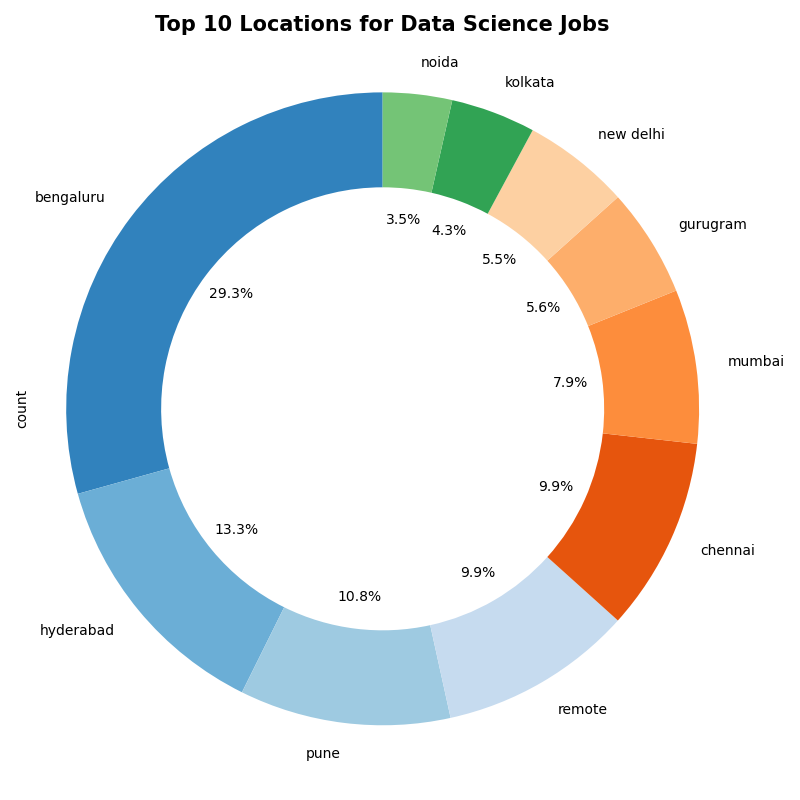

# 📊 Job-Market-analysis-for-Data-Scientists

This project performs a comprehensive **exploratory data analysis** of Data Science job listings using Python. By scraping, cleaning, visualizing, and clustering real job data, we reveal valuable insights into hiring trends, skills in demand, and regional opportunities for aspiring data professionals.

---

## 🧾 Project Objective

- Identify **top hiring locations** and **companies**
- Highlight **in-demand roles**, **skills**, and **tools**
- Analyze **experience requirements**
- Apply **dimensionality reduction (PCA, UMAP)** and **KMeans clustering** to find hidden structures in job locations

---

## 📁 Dataset Fields

| Column      | Description                                      |
|-------------|--------------------------------------------------|
| `roles`     | Job title (e.g., Data Scientist)                |
| `companies` | Hiring organization                             |
| `locations` | List of one or more job locations               |
| `experience`| Required experience in years                    |
| `skills`    | Key skills and tools mentioned in the job posts |

---

## 📊 Visual Storytelling

### 🗺️ Top Hiring Locations

> **Insight**: Bangalore, Hyderabad, and Pune are the most frequent cities for data science job listings.

---

### 🏢 Top Hiring Companies

> A few large firms dominate the postings, possibly staffing multiple projects or clients.

---

### 💼 Most Common Roles

> The most advertised roles are **Data Scientist**, **ML Engineer**, and **Data Analyst**.

---

### 🧪 Experience Requirements

> Most jobs target **mid-career professionals** (2–6 years of experience).

---

### 🛠️ Most In-Demand Skills

> Skills like **Python**, **SQL**, **Machine Learning**, and **Deep Learning** appear most frequently.

---

## 🧠 Domain-Specific Skill Trends

### 🔬 Data Science Domains

### 🧑‍💻 Programming Languages

### ☁️ Cloud Providers

### ⚙️ Big Data Technologies

### 📊 Visualization Tools

---

## 🧭 Location Clustering with PCA & UMAP

> Using **UMAP** and **KMeans**, we discover meaningful clusters in job location patterns—hiring hubs share proximity in high-dimensional space.

---

## ✅ Key Conclusions

📌 **Top Cities**: Bangalore, Hyderabad, and Pune dominate job opportunities.  
📌 **Top Roles**: Classical data science roles continue to lead the market.  
📌 **Experience**: 2–6 years experience range is in highest demand.  
📌 **Skills**: Python, SQL, Machine Learning, Deep Learning are essentials.  
📌 **Tools & Cloud**: Tableau, Power BI, AWS, and TensorFlow are commonly mentioned.  
📌 **Regional Insight**: Clustering reveals regional similarities that may guide relocation or job search strategy.

---

## 💼 License

This project is licensed under the MIT License.

---

## 👤 Author

**Ommair Ishaque**
Ph.D. Candidate, Computational Physics
University of Delaware
GitHub: [ommair](https://github.com/ommair)

---
